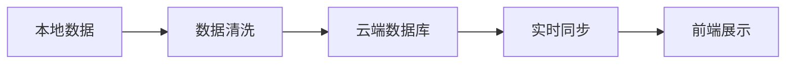
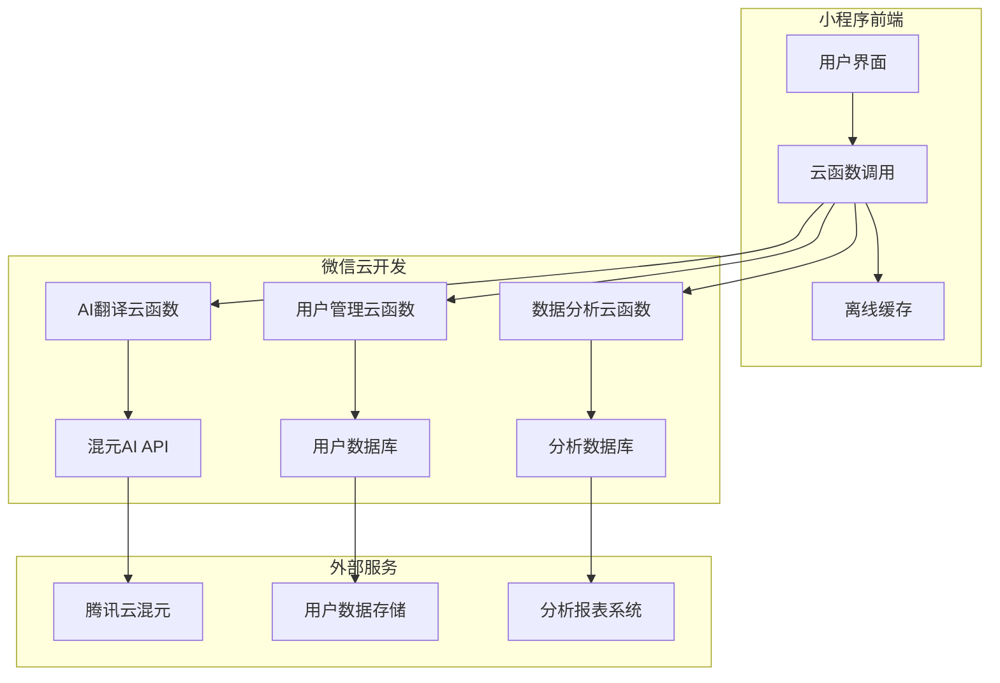

# 🚀 微信云开发 + 混元AI 版本迭代计划

## 🎯 项目背景与愿景

### 📊 资源优势分析
您拥有非常优质的微信云开发资源：
- **云开发环境**: `cloudbase-0gkqu2y430f74aa9`
- **混元AI免费Token**: 强大的AI能力支持
- **腾讯云账号**: `100045935425`
- **微信AI小程序成长计划**: 技术支持和培训资源

### 🌟 愿景目标
将随礼那点事儿从纯前端工具升级为AI智能助手，打造红包文化领域的小程序标杆。

## 📅 迭代规划总览

### 🎯 v2.0.0 - 云开发基础版 (2026年3-4月)
**核心目标**: 搭建云开发架构，集成混元AI基础功能
- ☁️ 微信云开发环境部署
- 🤖 混元AI智能翻译集成  
- 📊 用户行为数据收集
- 🔄 云端祝福语动态更新

### 🚀 v2.1.0 - AI增强版 (2026年5月)
**核心目标**: 深化AI能力，个性化用户体验
- 🎨 智能个性化推荐
- 💬 多轮AI对话翻译
- 🎯 用户画像系统
- 📈 数据可视化分析

### 🌟 v2.2.0 - 生态整合版 (2026年6月)
**核心目标**: 开放生态，用户共创
- 👥 用户内容创作平台
- 🔌 开放API接口
- 🎭 AR红包特效
- 🌐 第三方服务整合

## 🔧 v2.0.0 云开发基础版详细规划

### 📋 阶段一：基础设施搭建 (3月1-15日)

#### ☁️ 云开发环境配置
**任务清单**:
- [ ] 云开发环境初始化
- [ ] 数据库集合设计
- [ ] 云函数架构搭建
- [ ] 安全策略配置

**技术要点**:
```javascript
// 环境配置示例
const cloud = require('@cloudbase/node-sdk');
const app = cloud.init({
  env: 'cloudbase-0gkqu2y430f74aa9'
});
const db = app.database();
```

**交付物**: 可正常运行的云开发环境，数据库结构就绪

#### 🤖 混元AI基础集成
**任务清单**:
- [ ] 混元API密钥配置
- [ ] 基础翻译接口对接
- [ ] 错误处理机制
- [ ] 性能监控建立

**技术要点**:
```javascript
// AI翻译接口示例
async function translateWithAI(text, region) {
  const response = await fetch('https://hunyuan.cloud.tencent.com/hybridllm', {
    method: 'POST',
    headers: {
      'Authorization': `Bearer ${HUNYUAN_API_KEY}`
    },
    body: JSON.stringify({ text, region })
  });
  return response.json();
}
```

**交付物**: AI翻译云函数，基础翻译能力可用

### 📋 阶段二：核心功能迁移 (3月16-31日)

#### 📊 数据迁移与同步
**任务清单**:
- [ ] 现有祝福语数据导入云端
- [ ] 数据格式标准化
- [ ] 增量同步机制
- [ ] 数据验证测试

**技术架构**:


**交付物**: 完整的数据迁移方案，云端祝福语库就绪

#### 🎨 前端适配升级
**任务清单**:
- [ ] 云函数调用改造
- [ ] 离线缓存机制
- [ ] 用户体验优化
- [ ] 错误降级处理

**代码改造**:
```javascript
// 改造前 - 本地翻译
function translateText(text) {
  return localTranslate(text);
}

// 改造后 - 云端AI翻译
async function translateText(text) {
  try {
    const result = await wx.cloud.callFunction({
      name: 'ai-translator',
      data: { text }
    });
    return result;
  } catch (error) {
    return localTranslate(text); // 降级方案
  }
}
```

**交付物**: 适配云开发的前端代码，支持离线降级

### 📋 阶段三：AI功能深化 (4月1-15日)

#### 🧠 AI智能匹配算法
**任务清单**:
- [ ] 语义理解优化
- [ ] 上下文关联分析
- [ ] 多维度推荐算法
- [ ] 智能纠错机制

**算法设计**:
```javascript
// AI智能匹配流程
async function smartTranslate(input, context) {
  // 1. 理解用户意图
  const intent = await analyzeIntentAI(input);
  
  // 2. 结合上下文
  const enhancedContext = combineContext(context, intent);
  
  // 3. 生成智能翻译
  const result = await generateTranslationAI(input, enhancedContext);
  
  // 4. 验证和优化
  const verified = await validateTranslation(result);
  
  return verified;
}
```

**交付物**: 智能匹配算法，翻译准确率 > 90%

#### 📈 用户行为分析系统
**任务清单**:
- [ ] 行为数据埋点
- [ ] 用户画像构建
- [ ] 使用习惯分析
- [ ] 个性化推荐

**数据架构**:
```
用户行为数据模型:
├── 基础信息: 使用频率、活跃时段
├── 偏好数据: 常用分类、地域选择
├── 交互数据: 翻译次数、搜索关键词
└── 反馈数据: 评分、建议、问题报告
```

**交付物**: 用户行为分析系统，支持个性化推荐

### 📋 阶段四：测试优化 (4月16-30日)

#### 🧪 全面测试验证
**测试范围**:
- [ ] AI翻译准确性测试
- [ ] 云函数性能压测
- [ ] 网络异常处理
- [ ] 数据同步一致性

**性能指标**:
- AI响应时间 < 1.5秒
- 失败降级成功率 > 99%
- 数据同步延迟 < 200ms
- 系统可用性 > 99.9%

**交付物**: 完整的测试报告，性能优化方案

## 🚀 v2.1.0 AI增强版详细规划

### 📋 阶段一：个性化系统 (5月1-15日)

#### 👤 用户画像系统
**功能模块**:
- 用户基础画像：活跃度、使用习惯
- 内容偏好画像：常用分类、地域特色
- 交互行为画像：搜索偏好、操作习惯
- 智能推荐引擎：基于画像的个性化建议

**技术实现**:
```javascript
// 用户画像构建
class UserProfileSystem {
  constructor(userId) {
    this.userId = userId;
    this.profileData = {};
  }
  
  // 更新用户行为
  updateBehavior(action, context) {
    this.profileData[action] = {
      count: (this.profileData[action]?.count || 0) + 1,
      lastTime: Date.now(),
      context
    };
  }
  
  // 生成推荐
  async generateRecommendations() {
    return await wx.cloud.callFunction({
      name: 'personalized-recommend',
      data: { userId: this.userId, profile: this.profileData }
    });
  }
}
```

#### 💬 多轮AI对话
**功能特性**:
- 上下文记忆：记住对话历史和用户偏好
- 智能追问：主动询问用户补充信息
- 渐进式优化：根据反馈不断优化回答
- 多轮推理：复杂问题的分步解答

### 📋 阶段二：数据分析平台 (5月16-31日)

#### 📊 数据可视化分析
**分析维度**:
- 用户活跃度分析
- 功能使用统计
- 地域分布分析
- 时间模式分析

**可视化展示**:
- 实时使用数据仪表盘
- 用户行为热力图
- 祝福语流行度排行
- 系统性能监控图表

## 🌟 v2.2.0 生态整合版详细规划

### 📋 用户创作平台 (6月1-15日)

#### ✍️ 祝福语创作工具
- 用户自定义祝福语创建
- AI辅助内容优化建议
- 社区投票和审核机制
- 优秀作品推荐和展示

#### 🔌 开放API平台
- 提供标准API接口
- 开发者文档和示例
- 调用频次限制管理
- 合作伙伴接入支持

### 📋 第三方服务整合 (6月16-30日)

#### 🎭 AR红包体验
- AR动画效果集成
- 3D红包展示功能
- 社交分享AR效果
- 品牌定制模板

#### 🌐 服务生态整合
- 电商平台链接
- 金融服务对接
- 文化内容聚合
- 本地化服务整合

## 🛠️ 技术架构演进

### 📊 系统架构图


### 🔧 技术栈选择
- **云开发SDK**: 微信官方@cloudbase/node-sdk
- **AI服务**: 腾讯混元大模型API
- **前端框架**: 微信小程序原生
- **状态管理**: 本地storage + 云端同步
- **错误监控**: 自定义日志 + 云端分析

## 📈 项目管理与协作

### 📅 迭代节奏
- **小版本**: 2周一个迭代
- **中版本**: 1个月一个里程碑  
- **大版本**: 2-3个月一个主版本

### 👥 团队协作
- **开发者**: 负责功能开发和测试
- **产品经理**: 需求分析和产品规划
- **设计师**: UI/UX设计和交互优化
- **测试工程师**: 质量保证和性能测试

### 📊 质量保障
- **代码审查**: 所有代码必须经过审查
- **自动化测试**: 核心功能自动化测试覆盖
- **性能监控**: 实时监控关键性能指标
- **用户反馈**: 建立快速反馈响应机制

## 🎯 成功衡量指标

### 📊 业务指标
- 用户增长率: 月增长 > 20%
- 活跃度: 日活跃用户 > 5000
- 用户留存: 月留存率 > 70%
- 使用频次: 平均每周使用 > 5次

### 🤖 AI能力指标
- 翻译准确率: > 95%
- AI响应时间: < 1秒
- 用户满意度: > 4.5分
- 个性化匹配度: > 85%

### ☁️ 技术指标
- 系统可用性: > 99.95%
- 云函数响应: < 500ms
- API成功率: > 99.5%
- 数据同步延迟: < 100ms

## 📋 风险管理

### 🚨 技术风险
- **混元API配额不足**: 申请更多配额或优化使用策略
- **云开发费用超支**: 成本控制，按需使用资源
- **性能瓶颈**: 本地缓存+云端计算的混合架构

### 📉 业务风险
- **用户接受度不高**: 渐进式升级，保持原有体验
- **内容质量不达标**: 建立严格的内容审核机制
- **竞品快速跟进**: 持续创新，建立技术壁垒

### 💡 应对策略
- **降机方案**: 始终保持本地版本可用性
- **A/B测试**: 新功能小范围测试后再全面推广
- **用户教育**: 提供详细的使用指南和教程

---

**🎯 云开发版本核心优势**:
1. **技术领先**: 混元AI提供强大的语义理解能力
2. **成本优势**: 免费云开发资源，零服务器成本
3. **体验增强**: 个性化推荐，智能交互
4. **生态开放**: 开放API，扩展无限可能

**🚀 下一步行动**:
1. v1.0.0纯前端版本上线
2. 开始v2.0.0云开发版本基础设施搭建
3. 同步申请混元AI相关文档和技术支持
4. 制定详细的开发日程和里程碑